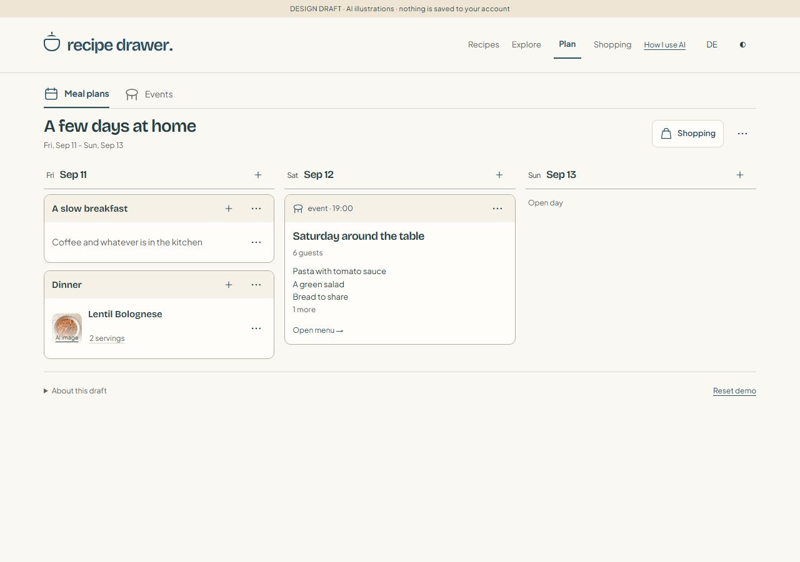
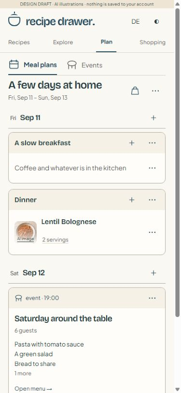
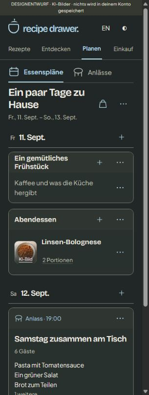
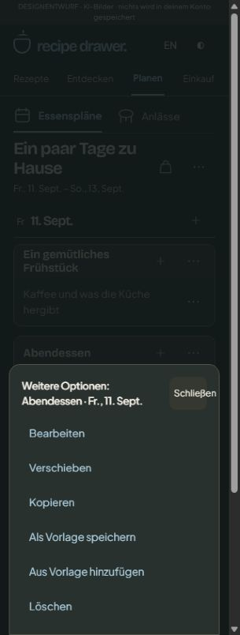
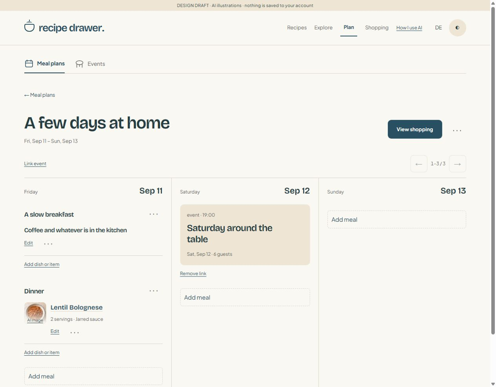
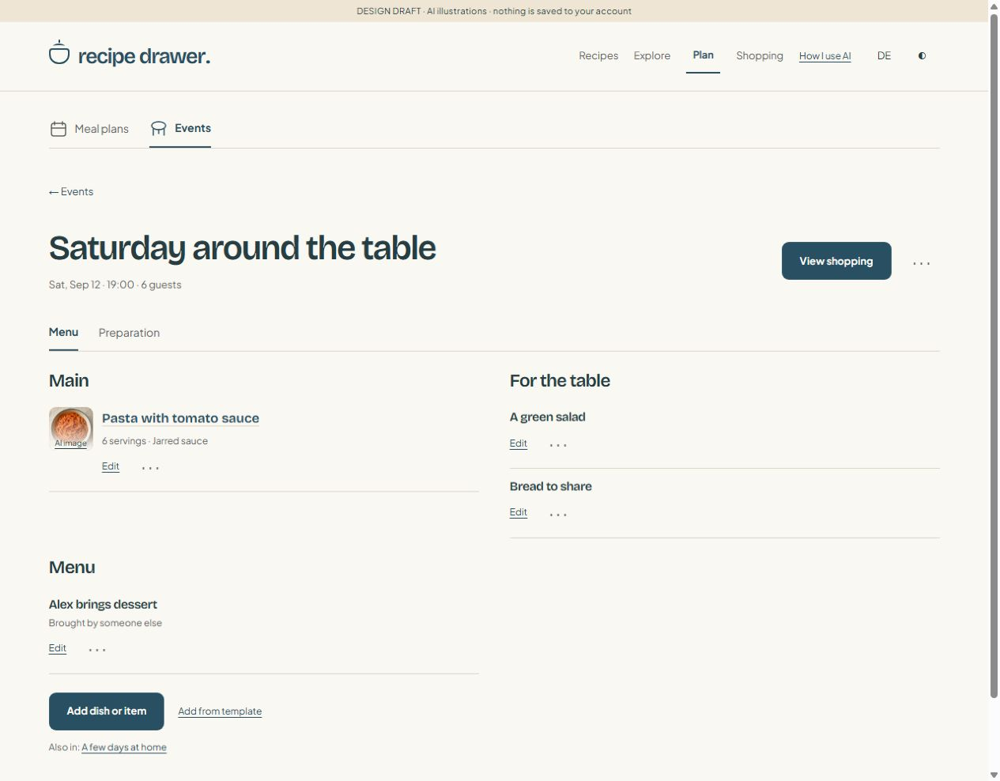
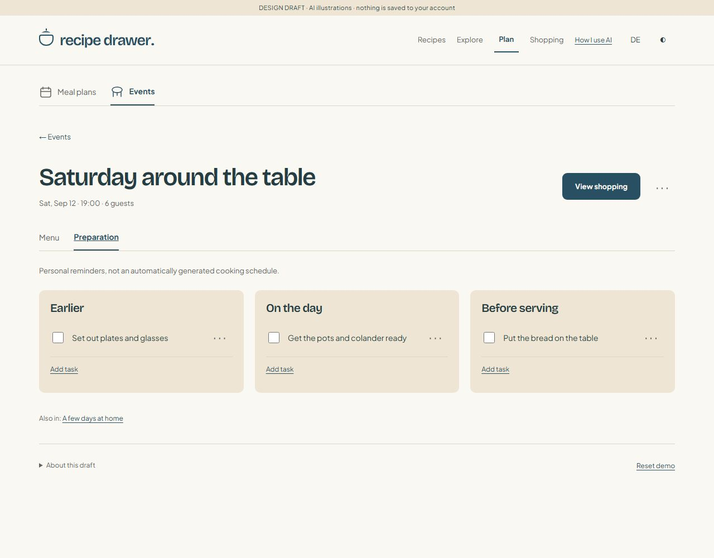
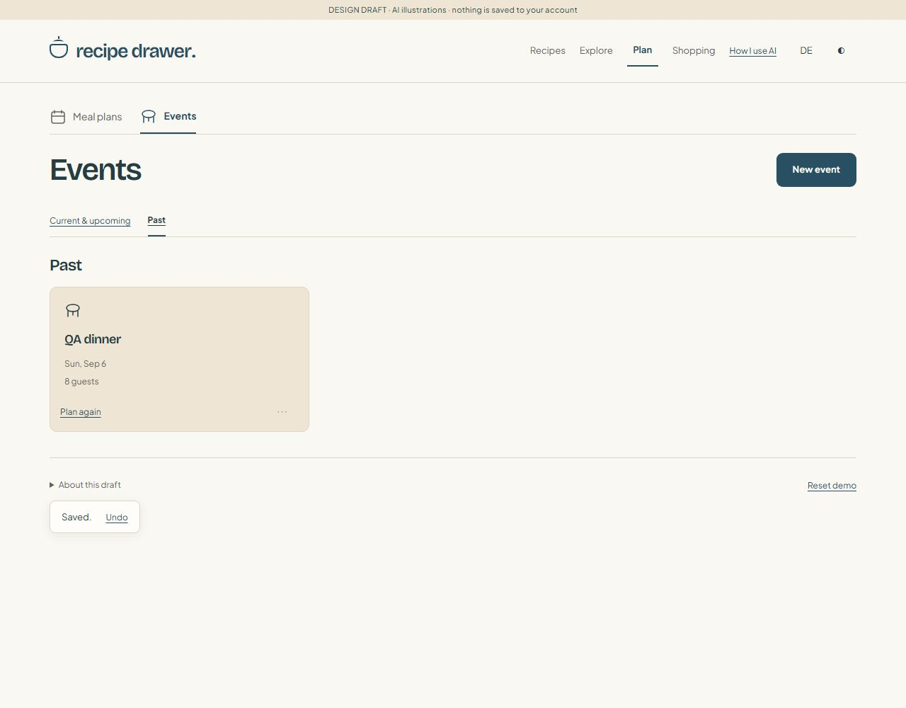
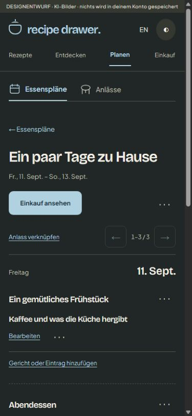
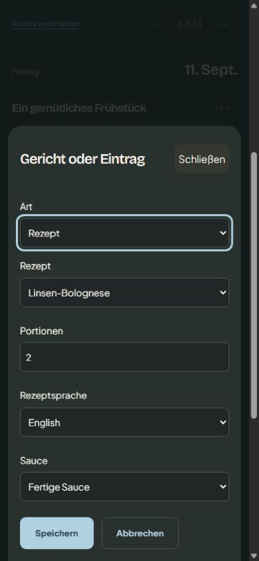

# Editable plans and repeat occasions — review checkpoint

Implemented in the local welcoming-kitchen prototype after the shopping review.
This completes the two next layers the user approved: flexible plan/event editing,
and current/upcoming/past browsing with independent **Plan again** copies.
It is not production integration or a claim that the whole seven-step pilot is done.

## Review routes

- `welcoming-kitchen.html?draft=cards1#plan`: current/upcoming meal plans; Past filter.
- `#plan/plans/weekend`: original sample agenda / bounded three-day board.
- `#plan/events`: current/upcoming events; Past filter.
- `#plan/event/saturday`: editable grouped menu; `/prep` for personal reminders.
- `#plan/recipe/party-main`: recipe preview using that planned dish's configuration.

## What changed

- Create, name, change dates and delete plans and events. Plans have any number of
  days, meals per day and items per meal. There are no compulsory meal slots.
- Add/edit recipes, personal items and notes. Personal items can have structured
  shopping ingredients using the existing stable IDs and compatible units.
- Explicit move/copy controls for meals and items, including destination and
  position. No drag-and-drop dependency. Meal names and times are optional.
- Each dish retains its own servings, language and sauce selection. **Change**
  opens that item's editor. Selected quantities and authored method appear in a
  separate configured preview, without changing either existing cooking attempt.
  Guided-cooking integration for planned items is not included in this prototype.
- Soup and salad stay planning examples with illustrative quantities, no food
  photos, no cooking method and no creator-verified claim.
- Event menus have optional groups, contributions excluded from shopping, guest
  following with per-dish overrides, and editable preparation reminders. Event
  links retain identity across plans. An event outside a plan's dates remains
  visible in a separate linked-events section, but not that plan's shopping.
- Meal/menu templates copy only independent items. Event repeats reset reminder
  checkboxes. Plan repeats shift all dates and create independent linked events,
  not new references to the old occasion. Legacy duplicate links copy once.
- Current/upcoming/past are derived from local calendar date (plan end date is
  decisive for becoming past). No archive maintenance or locked history.
- Destructive changes preview removed meals and invalidated shopping selections.
  Deleting an event names linked plans; deleting a plan preserves its events.
- One-step undo restores the exact pre-edit draft, only while no newer local edit
  has occurred. A cross-tab change still blocks writes; undo cannot overwrite it.
  Undo is session-only, not a persistent history feature.

## Persistence and data loss safeguards

Stable key: `recipe-drawer:planning-prototype:v1`; current envelope **v4**.
v1/v2/v3 drafts remain readable without rewriting on load. A successful local
action writes v4. Templates are validated records with unique template/item IDs.
Packs, batches and leftovers remain reserved empty arrays.

All editor actions first clone, edit, validate and reconcile a proposed state.
Confirmation commits that exact preview against its original state, rather than
rerunning copy operations and generating new IDs. Store-level raw-record checking
also rejects an unseen external write. Failed validation changes nothing.

Deleting an owner, shortening dates or removing a selected meal/event may make a
saved shopping selection invalid. Its loss (including checkmarks, personal list
items and extras) is explicitly confirmed and immediately undoable. Unaffected
selections remain, with requirements recalculated. Recipes never inherit shopping
extras, and copied owners never inherit purchase coverage.

Existing invalid-data recovery/download, reset-only-planning-data, quota failure
and cross-tab reload protections remain. Reset/reload clears stale editor undo.
No account imports, personal API writes or cook-attempt storage writes were added.

## Verification

```
node --test docs/prototypes/welcoming-planning.test.mjs docs/prototypes/welcoming-shopping.test.mjs docs/prototypes/welcoming-planning-editor.test.mjs
node docs/prototypes/welcoming-kitchen.test.mjs
```

89 planning/shopping/editor tests pass, plus the existing three recipe/Explore
test groups. Syntax checks and tracked diff whitespace checks pass.

New regression coverage: variable ranges and unnamed/multiple meals; item
isolation; moves and independent copies; date-trim previews; invalidated scopes;
event deduplication; guest overrides and contribution exclusion; deletion/link
semantics; independent templates; v3-to-v4 saving; period boundaries; localized
routes; configured recipe/example previews; stale baseline rejection and undo fencing.

Real in-app browser smoke checks performed:

- Created a ten-day plan, added a dinner and selected homemade sauce for four:
  400 g pasta / 800 g tomatoes / 2 tsp herbs, with the matching authored method.
- Created a past event, added a guest-following dish, changed guests from four to
  eight, repeated it into a future date and set the copy's dish to three servings.
- Added a preparation task and personal bread ingredient. Its shopping showed
  one loaf plus the three-serving recipe demand, not the eight-guest amount.
- Confirmed deletion/undo restores the event and its configured menu; plan
  deletion warns about the affected meal. Refresh preserved the test records.
- Cancel returned focus to the originating action. Long German dialog headings
  initially overflowed at 320 px; fixed and rechecked (dialog client/scroll width
  both 281 px; ingredient editor both 266 px).
- Agenda measured at 320/390/768/1280 px without horizontal page overflow.
  EN/light desktop and DE/dark phone views visually inspected; localized forms
  and configured recipe text exercised. This is not an exhaustive accessibility
  or all-screen/all-width acceptance pass.
- Removed only the QA plan and two QA events afterwards; original sample meals,
  event and shopping checkmarks were not reset. Screenshots containing “QA” are
  explicitly temporary test fixtures, not new default content.

No production build/database verification was necessary for these standalone
HTML/JS modules. No commit, push or deployment was performed.

## Compact card review — September 8

The UI/UX review informed the hierarchy: days are lanes, meals have one clear
card boundary, and dishes are compact rows inside each card. Warm oat headers,
cream surfaces and enamel-blue controls retain the existing kitchen identity.
There are no nested dish cards or extra dashboard summaries.

- Shorter plan header; no duplicate back link or redundant paging for three days.
  Longer plans retain a bounded three-day window with a date-jump control.
- Linked events use the same card language and preview their menu. Events outside
  the plan range keep their date visible; event identity and shopping rules remain.
- More-options actions open an anchored desktop dialog / phone action sheet,
  instead of expanding inline. Escape, Close and backdrop dismissal are supported.
- Servings and sauce have dedicated quick editors. Full Edit remains available.
  Guest-following quantities start disabled, with focus on the enabled checkbox;
  unchecking it enables a per-dish quantity. Cancel does not alter the draft.
- No data schema, production API or cook-attempt changes. Existing validation,
  revision fencing, shopping reconciliation and undo are reused.

Additional automated checks cover compact grouping, inert action templates,
per-field quick edits, a busy ten-day EN/DE fixture with multiple dishes per meal,
bounded date windows and dated out-of-range events.

Real-browser checks for this pass:

- Saved three servings for Bolognese and restored two with Undo. Changed the event
  sauce to tomatoes/herbs, retained six servings, then restored the jar with Undo.
- Guest-following checkbox receives initial focus and enables the quantity field
  when unchecked. Cancel preserves the original event settings.
- Menu → Edit → Cancel returns focus to its originating options button. Opening
  the menu leaves the first meal at the same desktop position (311 px).
- EN/light at 390 and 1280 px, DE/dark at 320 and 768 px: no horizontal page
  overflow. The 320 px action sheet's client and scroll widths both measured
  279 px. Screenshots below are the actual wired preview, not mockups.
- At 390 px the first meal now starts around 284 px; the earlier review's first
  day started around 517 px. More of the plan is visible before scrolling.
- Test edits were undone; no QA owners or permanent sample-data changes remain.

This is a focused browser smoke pass, not the complete keyboard or locale/theme
matrix. The busy ten-day fixture is automated rendering coverage, not a newly
captured browser screenshot. The remaining acceptance gates below still apply.






## Earlier editor checkpoint screenshots








## Remaining gates and later layers

User visual/interaction review is next. A full keyboard-only journey, complete
EN/DE × light/dark × width matrix, reopen-browser persistence and multi-tab editor
walkthrough remain human/browser acceptance work; storage conflict behavior is
covered by automated tests, not newly re-run in two real tabs here.

Then: editable packs and **Use the rest**, explicit shared preparation and meal
leftovers, full-journey polish. The Explore-to-plan shortcut is also still a later
journey connection; dishes can already be added through the plan/event editor.
No production API/account/household integration, nutrition automation, pantry
inventory or expanded curriculum. Culinary equipment, timing, yield and image
comparison approval remain separate from this UI review.
