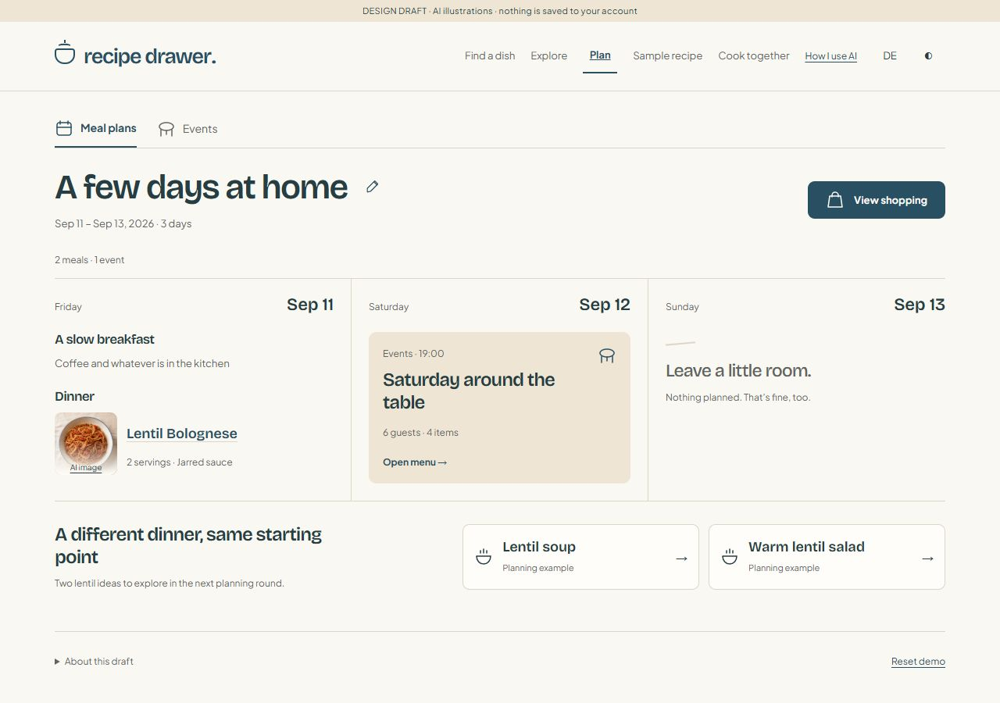
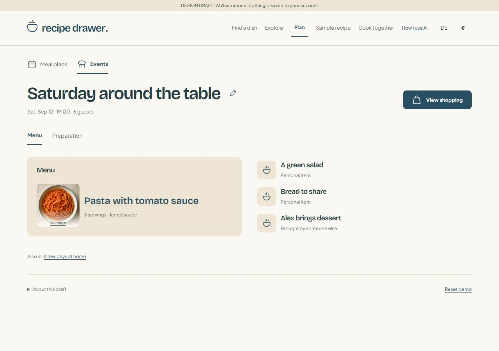
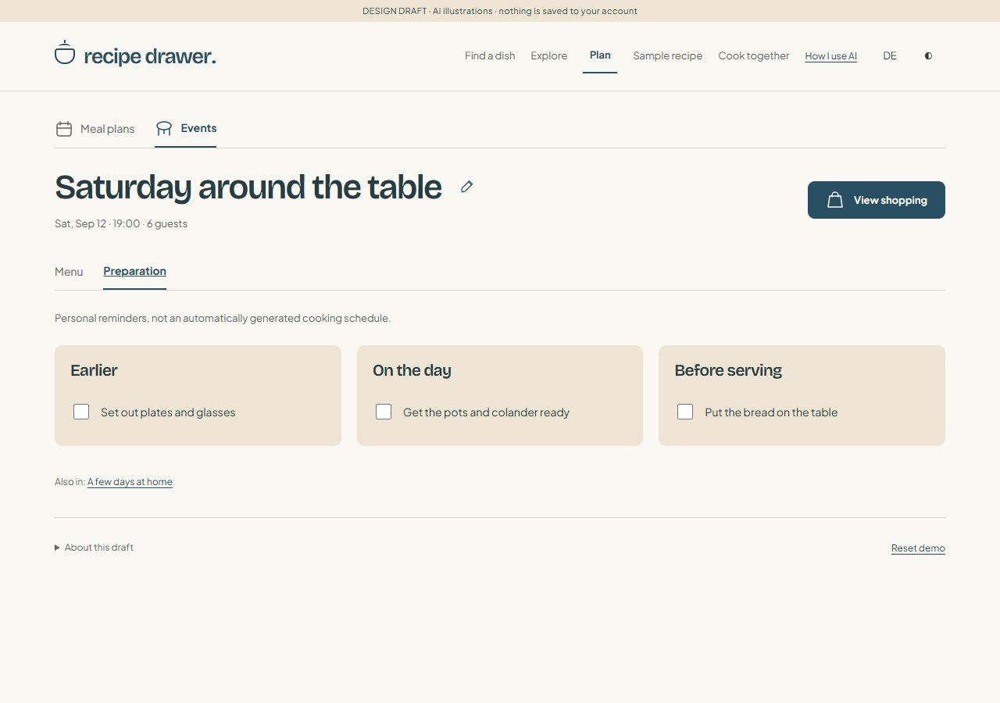
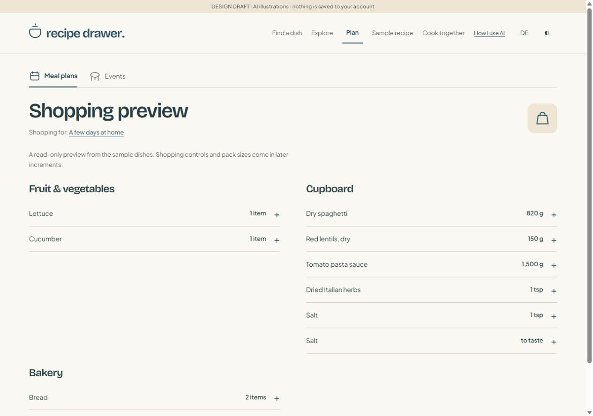
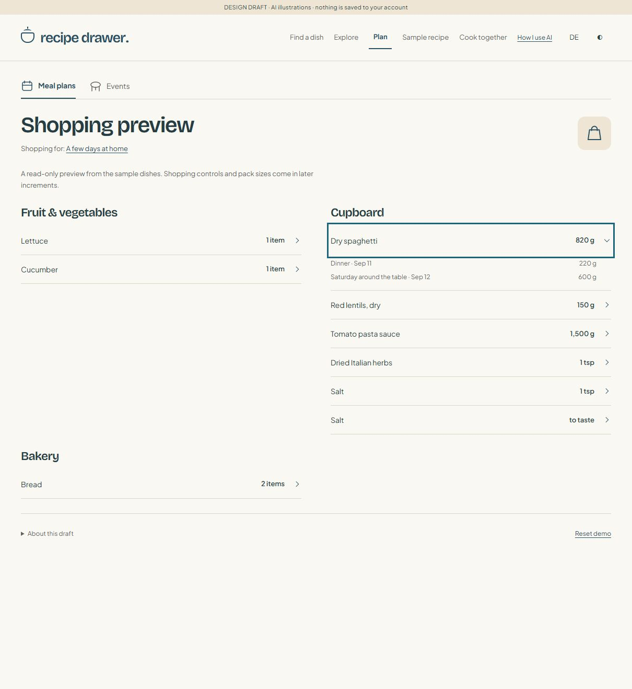
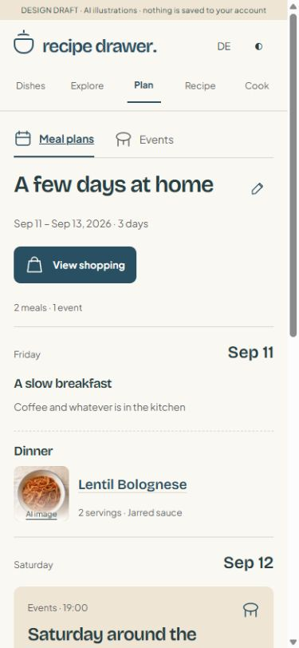

# Flexible planning prototype — foundation review record

Historical record of the foundation increment and its original delivery order.
The user subsequently asked to implement interactive shopping next. The read-only
shopping description, v1 envelope and future shopping steps below describe that
earlier checkpoint, not the current prototype. See the current
[shopping implementation and acceptance notes](welcoming-shopping-notes.md).
Neither checkpoint is production-integrated. The subsequent
[editable plans/events and Plan again checkpoint](welcoming-planning-editor-notes.md)
is now implemented for review; the foundation-only statements below are historical.

Open `welcoming-kitchen.html?draft=planning1#plan` through the existing prototype
server (currently `http://127.0.0.1:5098`). No build or application server is needed.

## What can be reviewed now

- Plan destination, Meal plans / Events navigation, independent shopping links.
- Three-day example, 11–13 September 2026: two Friday meals, Saturday's linked
  dinner event, and an intentionally empty Sunday. These dates are demo fixtures.
- Bounded three-column desktop board, chronological phone agenda; date paging
  appears for longer ranges. Three days is not a data-model limit.
- Plan and event title editing; native dialogs; preparation checkbox saving.
- Event Menu / Preparation views. Tasks are personal reminders, not a timetable.
- Read-only shopping preview for the entire plan or the event, with expandable
  sources and linked-event deduplication. Date/meal scope controls are not built yet.
- Existing tomato pasta / lentil Bolognese illustrations, with AI disclosure.
- Lentil soup / warm lentil salad detail previews: illustrative quantities only,
  neutral placeholders, no cooking method or creator-verification claim.
- Versioned browser-local saving, confirmed demo reset, recovery download for
  unreadable records, storage-failure warnings and cross-tab reload conflicts.
- EN/DE, inherited light/dark tokens and shorter phone navigation labels.
- Recipe/cooking navigation remembers the last recipe context through a planning
  detour, including when the theme is changed. Existing cook state is not edited.

Planned dish clicks currently open quantity details, not a configured cooking
screen. Recipe configuration handoff belongs to increment 2. Global recipe and
cooking destinations continue to work. Existing recipe/cook demos remain
memory-only; only the new planning data survives refresh.

## Files and state ownership

| File | Responsibility |
| --- | --- |
| `welcoming-planning-core.js` | Pure fixture/domain functions, validation, derived quantities, local draft adapter |
| `welcoming-planning.js` | Localised views, routes, dialogs and UI actions |
| `welcoming-planning.css` | Kitchen-token styling and responsive layouts |
| `welcoming-planning.test.mjs` | Domain, storage, markup and navigation regression tests |

Record key: `recipe-drawer:planning-prototype:v1`.
Envelope: `{ version: 1, revision: integer, data: ... }`.
Initial seeding happens only on the first visit to Plan, not on a recipe visit.
Local actions validate a cloned state before replacing the current draft.
Saved raw data is compared before edits and on `storage` events; conflicts block
edits until reload. Unreadable/unsupported data is retained, with download and
explicit reset controls. If storage is inaccessible, editing remains in memory;
an unreadable record is never overwritten by a write attempt.

Reset removes only this key and recreates the sample. It does not clear browser
storage generally. No account records, household planner, APIs, authentication,
database migrations, network writes or account import are involved.

## Contract for the following increments

Implemented v1 entities:

- Plan: stable ID, localised/user title, inclusive ISO date range, ordered meals,
  and event IDs referencing independent event records.
- Meal: stable ID, date, optional name/time, ordered items.
- Dish item: stable ID, catalog ID, language, servings, independent component
  choices. Event dishes carry the `followsGuests` flag for the forthcoming editor.
- Personal item / note: separate kinds; optional structured illustrative needs.
- Event: stable ID, name/date/time, guest count, menu, contribution flags, grouped
  reminders. Contributed items are excluded from host shopping.
- Ingredients: stable catalog IDs, never translated strings. In this fixture
  `lentils` exclusively means **dry red lentils**. Canned/cooked lentils must get
  new IDs, not aliases. No raw-to-cooked yield or volume-to-weight conversion.
- Derived shopping: owner kind/ID, ingredient/unit key, amount and source items.
  Salt by teaspoon and salt to taste are deliberately separate rows.

Reserved arrays `templates`, `purchases`, `batches`, `leftovers` are empty in v1.
Nonempty future records are rejected rather than silently misinterpreted.
Introduce an explicit migration/version when implementing those contracts:

| Concept | Required future fields / invariant |
| --- | --- |
| Shopping scope | Stable scope ID, owner reference, selected dates/meals or event; not inferred from plan duration |
| Purchase assumption | Scope, ingredient/form ID, pack quantity/unit/count; no shared stock across unrelated scopes |
| Preparation batch | Stable ID, raw inputs, explicitly authored output quantity/unit and allocations to item/components |
| Leftover allocation | Source cooked-meal batch ID, destination meal, allocated servings, planned/confirmed availability |
| Template | Independent copied menu/meal items; fresh IDs; no retained event date or live links |

All identifiers must be stable, all references validated, and newly created
items need fresh IDs. Keep shopping derived from source state; do not increment
stored totals. Changes to servings/options must not affect other planned copies
or an active cook. Batch quantities are not inferred cooking yields.

## Remaining delivery sequence

Shopping feedback after increment 1:

- Implemented: ingredient-specific count labels in totals, source details and
  example ingredients (lettuce heads, whole cucumbers, bread loaves), localised
  and pluralised in EN/DE. Existing numerical demo quantities are unchanged.
  These are explicit fixture forms, not inferred weights or verified serving
  recommendations; bagged lettuce and sliced bread need distinct forms later.
- Implemented now: replace the plus/minus disclosure mark with a right/down
  chevron. The whole native summary row remains keyboard/touch operable.
- Quantity editing belongs in increment 4, not the read-only shell. Preserve the
  computed recipe requirement; allow an explicit additional amount, never a
  total below the requirement. Show an indented `Extra 100 g` entry only when an
  extra exists. For the sample's 820 g spaghetti requirement, 100 g extra means
  a 920 g target, without changing either recipe's servings or ingredients.
- Store extras as scope-specific adjustments, not fake recipe contributions.
  Recalculation changes the recipe baseline while retaining the explicit extra;
  clearing the extra returns to the baseline. An empty scope must not conceal
  a retained extra: expose it for review/removal or as a personal shopping item.
- Keep `Already have` and `Purchased` distinguishable: both cover shopping needs,
  neither deletes recipe demand or creates pantry stock. The normal checkbox
  marks Purchased; a contextual Already have action records existing coverage.
  Reopening either status returns it to Needed. Increased demand requires review.
- An optional partial-have quantity could reduce what remains to buy without
  reducing recipe needs; keep that out of the initial editor unless needed.
- In increment 5, keep deliberate extras distinct from pack-rounding surplus;
  do not count an extra twice as both a requirement and another recipe allocation.

These quantity/status controls are design requirements for later increments,
not implemented capabilities of the current preview.

1. **This increment: shell and sample data — awaiting user review.**
2. Flexible plans: plan/date CRUD; any number of meals/items; explicit move/copy;
   confirmed range shortening; undo; meal templates; isolated choices/servings;
   configured real-recipe handoff and planning-example detail-only handling.
3. Events: occasion/menu editing, guest-follow overrides, contributions, groups,
   editable preparation tasks, event links, move/copy/delete semantics and templates.
4. Shopping: selected dates/meals, compatible-unit consolidation, source details,
   personal shopping items, already-have/purchased/review states, recalculation.
5. Packs and Use the rest: editable scope-specific assumptions, shortfall/surplus,
   deterministic ingredient/form suggestions, preview/cancel/confirm before adding.
   Demonstrate 500 g dry lentils minus 150 g, then minus 200 g = 150 g surplus.
6. Shared preparation, leftovers and optional learning: explicit yields/allocations,
   no duplicated demand, dependent-removal resolution, confirmed vs planned food,
   contextual Change/practice without automatic harder choices or safety claims.
7. Complete-journey polish, full browser acceptance, final regression suite and
   production-gap handoff. No automatic commit, push, deployment or recruitment.

Each increment brings its own regression tests and user review checkpoint.
The existing production planner will eventually need dated meal grouping, event
references, selected recipe components, source-aware shopping and quantity
allocations. **This prototype does not implement any of those API changes.**

## Verification evidence

Run from the repository root:

```sh
node --test docs/prototypes/welcoming-planning.test.mjs
node docs/prototypes/welcoming-kitchen.test.mjs
```

- 17 new tests passing: seed, flexible/long date windows, source totals, event
  deduplication, per-item options, unit separation, invalid input, save/reload,
  scoped reset, corrupt/future data recovery, storage failures, conflicts,
  rollback, EN/DE, empty/unknown routes, escaping and recipe context retention.
  Follow-up coverage checks native shopping disclosures and decorative chevrons;
  real-browser click/Enter expansion and collapse retain keyboard focus.
- Existing three recipe/Explore regression groups still pass.
- Real browser: four views × four widths (320/390/768/1280) × two languages ×
  two themes = **64 layout combinations** checked. No page overflow, missing
  headings or broken images. No browser console errors observed.
- Title save via Enter survives reload; two-tab editing surfaces a reload warning.
  Preparation checkbox survives reload. Reset cancellation returns focus; confirmed
  reset restores the sample. Example dialog closes with Escape and restores focus.
- Cooking detour preserves the current lentil step and ingredient checkboxes,
  including a theme change while on Plan. Automated test also checks tomato context.
- Invalid-storage/read/write failure cases are automated adapter tests, not browser
  fault injection. Full browser process shutdown/relaunch is not tested; reload and
  a newly opened tab are tested. Not a screen-reader or exhaustive keyboard audit.
- Production build/release sync not rerun: production code/dependencies unchanged.
  Later increment acceptance (CRUD, surplus, batch/leftovers) is not claimed here.
- Culinary quantity, timing, yield and storage approval remains a separate gate.

## Screenshots of the wired views

### Meal plan — desktop



### Event menu



### Event preparation



### Shopping preview



Follow-up: chevrons replace plus/minus; spaghetti expanded with keyboard focus.



### Meal plan — phone


