# Interactive shopping — review checkpoint

Status: implemented in the locally saved design prototype, awaiting user review.
No production APIs, accounts, household data or cooking attempts were changed.
No commit, push, deployment or culinary approval is implied.

Follow-up: [editable plans/events and Plan again](welcoming-planning-editor-notes.md)
now operate on the same shopping data. Current storage envelope is v4 (v1/v2/v3
remain readable), with 84 combined planning/shopping/editor tests. Historical
checkpoint counts and schema versions below describe their original increments.

Open `http://127.0.0.1:5098/welcoming-kitchen.html?draft=shopping1#shopping`.
Specific lists are at `#shopping/plan/weekend` and `#shopping/event/saturday`.
Earlier `#plan/shopping/...` links remain supported. The prototype is served from
`docs/prototypes` in the `codex/teaching-pilot-hardening` worktree.

## What to try

- Tick the checkbox or ingredient name to mark a row; only its arrow expands details.
- Dish view shows Dish / Total columns without expanding. The checkbox covers only
  that dish's requirement. A non-blocking follow-up offers Check all, Undo and Dismiss.
  Undo reverses the latest check action, including Check all; it does not overwrite
  newer changes. Consolidated views show a mixed checkbox and remaining quantity.
- Open the arrow for source quantities and two contextual actions: Already have
  (Undo when covered) and Change amount. Only Change amount opens the editor.
- The whole-plan spaghetti demand is 820 g. Save 920 g to see a separate Extra
  100 g line. A total below 820 g resets to 820 g when leaving the field or saving,
  never mid-typing. Save persists that correction; blur alone only updates
  the field. Empty/invalid values still show an inline error.
- Already have covers the selected quantity; it does not remove recipe demand or
  create an assumed pantry balance. Whole-dish coverage is supported; arbitrary
  partial weights within one dish and cross-trip pantry tracking are not implemented.
- Increase a covered amount: Check amount remains until explicit reconfirmation,
  including after refresh or a later decrease. Coverage labels are not struck out.
- Add a personal item, choose its quantity/unit, then edit/remove/undo it.
- Change selection to a date range or selected meals/events. Friday needs 220 g
  spaghetti, Saturday's event 600 g. An empty selection includes no recipe needs.
- Returning to a selection restores that selection's extras, additions and checks.

The two desktop columns have independent vertical flow; mobile is one checklist.
Amounts stay aligned. Secondary controls live inside native disclosure rows.
Checkbox labels have 44 px-wide hit areas, independent of disclosure controls.

## State and calculation contract

### Grouping and date-window follow-up

View offers Category (the previous layout), A–Z, Dish and Amount. A–Z follows the
displayed language and includes personal additions and single seasoning rows.
Dish groups use recipe identities/personal menu items, not meal titles. Each dish
shows its full ingredient list and its own quantities (Bolognese spaghetti 220 g;
tomato pasta 600 g). Shared ingredients are references to one shopping aggregate,
not duplicated purchases. There is no Shared across dishes category. Expanding a
reference shows meal/date contributions, a subtle Also in reference, the combined
shopping total. Shared totals also have their own quieter, right-aligned column.
Checkbox and name cover only this dish; the follow-up Check all covers the combined
requirement plus extras. Change amount edits the combined total, never a recipe
requirement. Extras have their own checkbox in details. Seasonings retain their
quantity-free summaries and separate measured/to-taste source details; their dish
checkbox covers only that dish, with the same Check all option. Repeated instances of one recipe
stay in one recipe group. Orphan extras and personal shopping additions remain
available in separate groups. Per-dish partial coverage is preserved across views
and refresh; selected shopping scopes remain independent.

Amount orders Weight, Count, then Other. Weights sort largest first using g/kg
equivalence; counted units (pieces, loaves, packs, bottles) sort by their number,
without inferring pack contents. Other quantities sort within their unit family
(l/ml are comparable); seasonings/qualitative amounts remain unmeasured and sort
alphabetically at the end. No weight/volume conversion is introduced. All views
reuse the same underlying aggregates. Dish references have distinct disclosure,
editor and focus identities; unsaved edits stay with their originating reference.
A successful aggregate amount save clears obsolete drafts for its other references.
Category, A–Z and Amount remain consolidated shopping checklists.

Optional `preferences.shoppingLayout` is a validated enum in the v3 local
record. Missing means Category. It is remembered globally for this prototype,
independently of the selected shopping scope, through the existing conflict-aware
store. Storage failure leaves the session usable with the existing warning; invalid
preferences fail closed. No production or cook-attempt records are changed.

Dates & meals exposes the existing scope dialog more clearly. Choose Date range,
set From/To and Apply selection; this filters the shopping list without shortening
the plan. The 2 days from start shortcut previews a two-day inclusive window from
the chosen From date, clipped at plan end; it does not apply until confirmed. When
first opening a range, From defaults to today if today is within the plan, otherwise
the plan start. Existing ranges keep their dates. A one-day window displays its
date once. Mobile date fields stack to avoid native input overflow.

Important: different date/meal selections still have independent extras, personal
items and coverage, as before. Grouping changes do not change this scope. This is
not cross-trip stock tracking or a pantry ledger.

Verification: 69 planning/shopping tests plus the three recipe/Explore groups pass.
Includes all four EN/DE views, stable keys, shared-dish references, locale sorting,
mixed units, unchanged recipe/coverage state, preserved editors, date clipping,
preference persistence, and storage/conflict behaviour. Browser checks exercised
all four views, the two-day preview/apply/refresh flow, and Friday-only filtering
(820 g pasta becomes 220 g; Saturday ingredients disappear). Original selected
meals were restored after testing. EN desktop and 320 px DE dark were inspected;
the date dialog was corrected and rechecked with no horizontal overflow at 320 px.
No full device/screen-reader audit or production build is claimed.

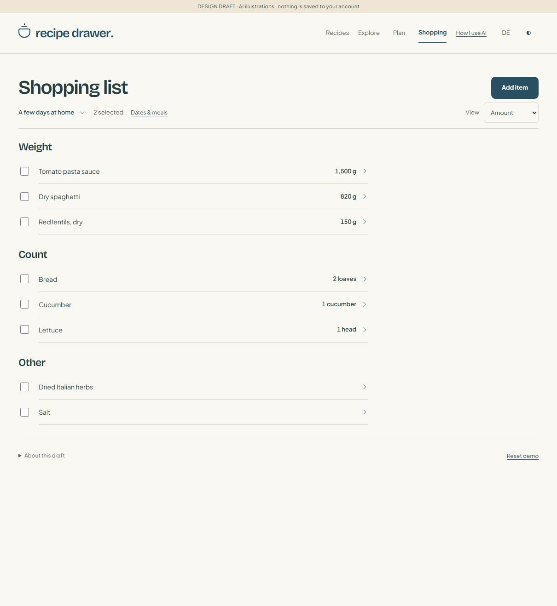

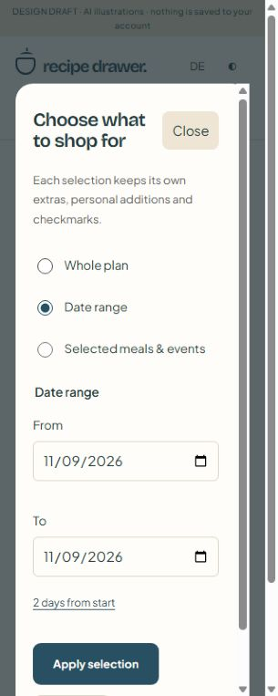

### Quieter labels and secondary actions

The herbs/spices note is now "Check your cupboard before buying" (EN/DE).
Explicitly selected Need to buy rows omit their redundant subtitle; untouched
cupboard checks, covered states and changed-demand warnings remain visible.
Recipe amounts are still available as source rows and as the list's accessible
name, but no longer have a separate visible heading. No coverage or checkbox
behaviour changed.

Row actions use the existing warm-grey muted token in light/dark mode, retaining
underlines, full touch targets and blue hover/keyboard-focus feedback. Names and
totals retain their stronger ink colour. Both theme pairs pass a 4.5:1 contrast
regression check. The 49 automated tests and existing recipe/Explore groups pass;
desktop EN and 390 px DE dark mode were visually checked, including blue keyboard
focus. No saved shopping records were edited for this presentation-only follow-up.

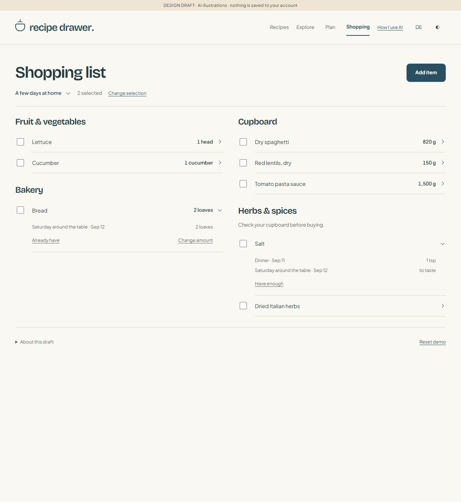

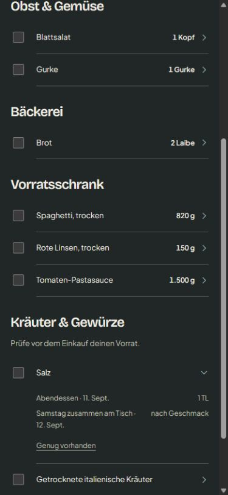

### Compact shopping follow-up

The heading is simply Shopping list. A compact plan/event-name button opens the
existing list picker; there is no Shopping for prefix or separate Switch list
text button. The current date/meal selection remains visible next to it. This is
presentation only: no independent list or storage-model change is introduced.

Normal ingredient disclosures show sources and Already have / Change amount.
Bought is handled by the checkbox, and covered rows offer Undo. Herbs & spices
keep their distinct cupboard-check semantics, but only show relevant secondary
actions instead of a permanent three-button toolbar. Personal items retain Edit
and Remove. Extras remain a separate line; Remove extra is in the amount editor.

Editors are opened explicitly, keyed by scope and ingredient, and retain unsaved
inputs through other row updates. Save closes the editor after a successful local
action; Cancel/Escape discard only that unsaved input. Both restore focus to
Change amount. Blank/invalid inputs keep the editor open with an inline error.
Explicit reload/reset clears editor state along with existing transient drafts.
Cross-tab conflicts still disable mutations; no saved data migration is needed.

Source quantities stay right-aligned when names wrap. Save/Cancel wrap together
on narrow screens; touch targets stay at least 44 px tall. At 320 px, long German
header controls wrap onto another line instead of breaking the heading mid-word.

Verification: 47 planning/shopping tests and all three recipe/Explore groups pass.
Browser checks covered open/cancel/Escape, focus return, minimum reset, extra
100 g, Already have, and refresh persistence. Blank input was tested using actual
keyboard deletion (the browser fill helper did not clear this number field).
The list picker opens and Escape returns focus to its name button. EN desktop and
DE dark mobile screens were inspected; no page overflow at 320/390/768/1280 px.
No console errors observed. Test amount/coverage changes were restored, and the
preview was left in English/light mode with the viewport override removed.
This is not a full screen-reader or every-device acceptance audit.

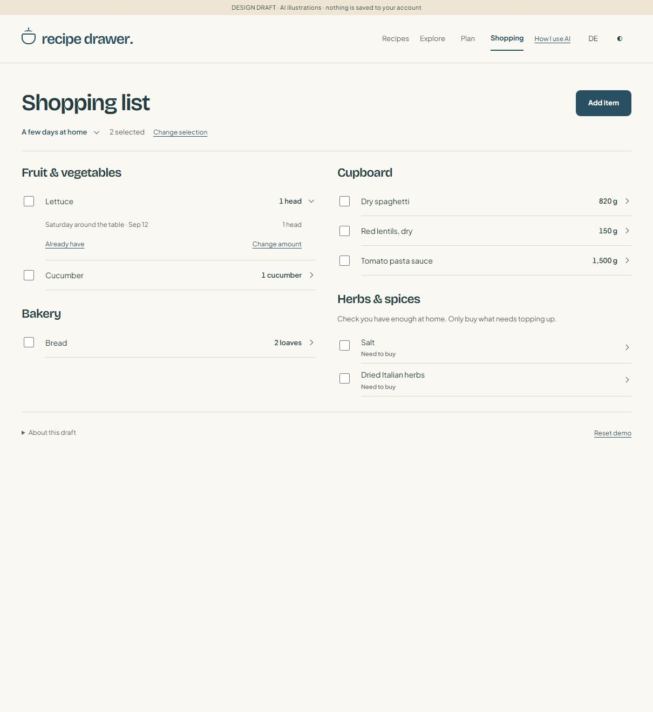

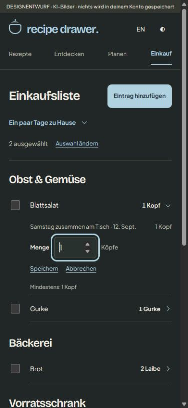

### Shopping navigation follow-up

Main navigation is now Recipes / Explore / Plan / Shopping (EN/DE). The sample
recipe and Cook together destinations are removed from the header; the recipe's
own cooking action and existing cooking deep links remain available. Shopping
does not display the Plan subnavigation, even when reached through an old link.
The current top-level destination has an explicit active state.

`#shopping` resolves the last visited plan/event and its existing selected scope.
Switch list shows available plans/events with names and dates. It changes the
owner reference, not the list contents. Plan/event View shopping links lead to the
same canonical destinations; old aliases use precisely the same records.
There is no independent unlinked list creation yet.

Optional `shopping.lastOwner = {kind, ownerId}` is backward-compatible with v2
drafts lacking the field. On a valid visit, only a changed owner is saved using
the existing validated/conflict-aware local adapter; repeated rendering does not
write. Invalid destinations do not replace the remembered owner. A deleted/missing
last owner falls back to the first plan, then event; no owners shows an explicit
empty state. Reset clears this preference along with the planning demo. A read-only
conflicted draft permits browsing but does not overwrite its saved preference.
As with other local changes, saving a different last owner can prompt another
open tab to reload; this is not account sync.

Verification: 44 automated planning/shopping tests plus existing recipe/Explore
groups pass. Browser: event → Plan → Shopping and refresh retain the event;
source link → event → View shopping works; switching back retains the plan's two
selected meals. Escape returns focus to Switch list. Desktop EN and 320 px DE dark
mode were inspected without horizontal overflow. The recipe cooking action remains
present. No production changes or standalone pantry/list model were introduced.

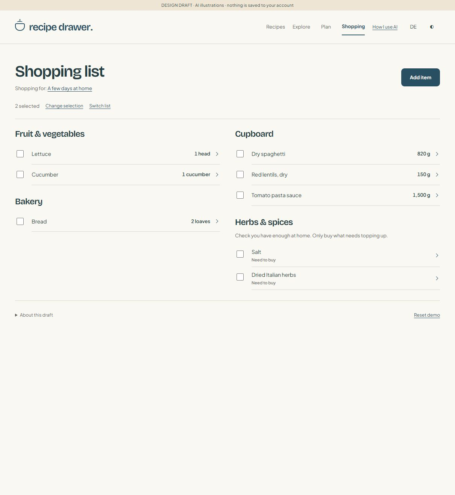

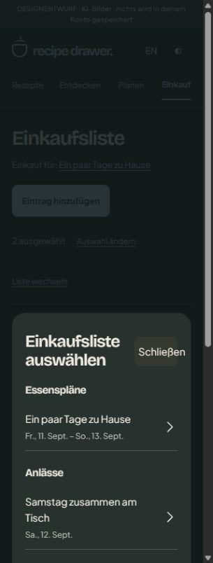

### Herbs & spices follow-up

Salt and dried herbs now appear in a separate Herbs & spices section with one
cupboard-check prompt. Each ingredient has one quantity-free summary, with its
separate recipe amounts inside the disclosure. Flour, oil and other borderline
ingredients are deliberately not classified as seasonings by this initial rule.

Have enough, Need to buy and Bought operate on all underlying unit rows in one
local action. No quantities are added across incompatible units. Initially nothing
is assumed available. The checkbox marks an unchecked cupboard item Have enough;
for an item explicitly marked Need to buy it marks Bought. Unticking a covered
item marks Need to buy. Accessible checkbox labels reflect the action. Mixed or
partly covered requirements ask for review; mixed have/bought coverage is labelled
Covered without inventing a purchase. Existing extras remain visible/removable.

This uses the existing v2 records, with no destructive migration. Pack quantities,
pantry stock and automatic purchase-size assumptions remain deferred. Personal
items called Salt are still independent, rather than matched by their name.

Follow-up verification: 40 automated tests pass, including grouping, source-unit
preservation, scoped persistence, old partial checks, increased demand, extras and
EN/DE summaries. Browser checks cover Have enough → refresh, Need to buy → Bought,
keyboard disclosure/focus, desktop EN and 390 px DE dark mode without overflow.

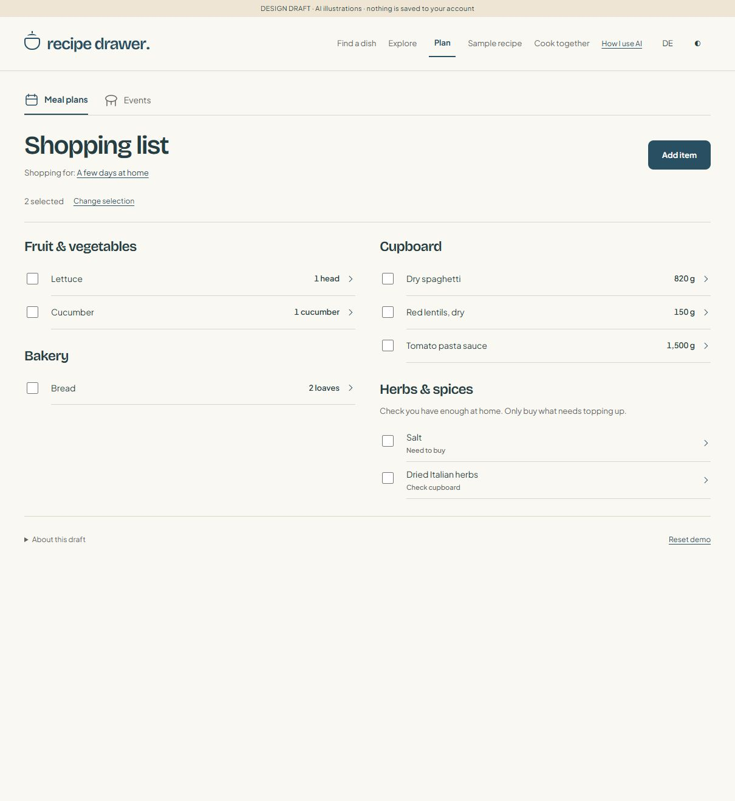

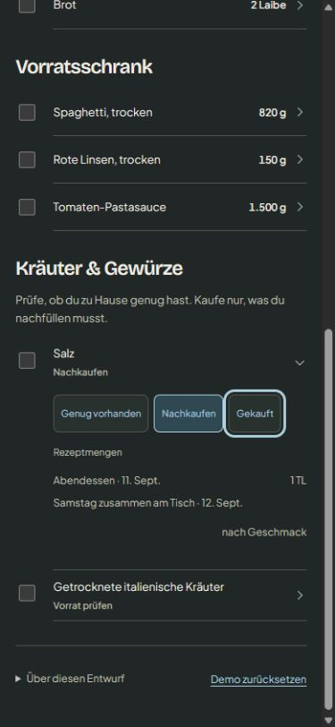

### Shared shopping contract

- `welcoming-planning-core.js`: fixtures, validation, quantities, scope identity,
  coverage reconciliation and local saving.
- `welcoming-shopping.js` / `.css`: EN/DE checklist, editors, scope dialog and style.
- `welcoming-shopping.test.mjs`: shopping regression tests, alongside the foundation
  and existing recipe/Explore tests.
- Stable storage key remains `recipe-drawer:planning-prototype:v1`. Its envelope is
  now `{version: 2, revision, data}`. A valid v1 draft gains empty shopping state
  in memory; its raw record is preserved until a successful edit writes v2.
  Invalid/future data is not overwritten. Existing titles and preparation checks
  survive migration. Cook state uses neither this record nor this migration.
- `shopping.scopes` stores owner kind/ID, mode (`all`, `dates`, `meals`), canonical
  sorted meal/event references or date bounds, adjustments and personal additions.
  A deterministic tuple key identifies each selection; `shopping.views` remembers
  the current selection per owner. Default whole scopes retrieve saved records
  even before the user explicitly opens the selection dialog.
- Adjustments store ingredient/form ID, unit and **extra**, never copied recipe
  totals. Needed amounts are re-derived from servings/options and source items.
  kg/g and l/ml can consolidate; volume and weight cannot. Taste-only quantities
  stay qualitative. Ingredient labels are never matching keys.
- Saved coverage records status, covered amount/signature and a sticky review
  flag. Changed demand is reconciled on every successful local action. If recipe
  demand disappears, intentional extras remain visible and removable; obsolete
  recipe-only coverage is removed rather than reused later.
- Personal items have independent IDs and never merge by display name into a
  recipe ingredient. Units such as bottle/pack are labels, not pack-size facts.
- Linked events are counted once within a selection; contributions are excluded.
  Separate selections are independent lists, not a global stock ledger. Shopping
  an event and shopping its parent plan separately does not synchronize checks.
- Removal Undo is single-level and session-only. It restores quantity and coverage.
  Explicit reload/reset clears transient undo and unsaved amount fields. Ordinary
  row updates preserve other unsaved total inputs. Only saved actions survive refresh.
- Storage failures retain usable in-memory state and display a warning. Conflicts
  block edits until explicit reload; invalid records offer download/reset.
  A failed reset does not discard transient edits. Reset only affects this prototype.

Future meal/date deletion or range shortening must resolve saved scope references
transactionally; current validation deliberately rejects dangling references. Full
planner CRUD has not yet been added. No batch/leftover demand exclusion is claimed
until those currently empty reserved contracts are implemented.

## Verification

```sh
node --test docs/prototypes/welcoming-planning.test.mjs docs/prototypes/welcoming-shopping.test.mjs
node docs/prototypes/welcoming-kitchen.test.mjs
```

- 69 automated planning/shopping tests pass; existing three recipe/Explore groups
  pass. Includes migration, min/extra, scope isolation, coverage/review persistence,
  event deduplication, unit dimensions, personal items/undo, malformed input,
  storage failures/conflicts, no personal API writes, and recipe-context regression.
- Real browser (initial checkpoint): 600 → 700 g gives Extra 100 g; 599 g failed;
  the subsequent minimum-reset change supersedes that error-only interaction.
  Follow-up browser check: typing 100 remains uninterrupted, then Tab restores
  820 g with no error. This field correction does not write the saved draft.
  Covering then increasing
  the target shows Check amount, retained after refresh. Personal bottled water
  can be added, covered, removed and restored with its coverage intact.
- Whole-plan, Friday-only, selected-event and empty-selection flows were exercised.
  Unsaved spaghetti input survives checking a different row. A newly opened tab
  loads saved state. Cross-tab change blocks edits and explicit reload gets the
  latest checks. No application console errors observed during these interactions.
- Shopping overflow checks passed at 320/390/768/1280 in EN/DE and light/dark.
  Actual mobile/desktop screens and mobile selection dialog were inspected.
  German personal-item validation at 320 px focuses the visible error; Escape
  closes the dialog and returns focus to Add item. Enter/Tab work in total editing.
- Long unbroken personal names were checked at 390 px without page overflow;
  the temporary QA item was removed. This is not a full screen-reader, zoom,
  device-keyboard or every-dialog/every-width acceptance audit.
- Malformed-storage and inaccessible-storage cases are automated adapter tests,
  not browser fault injection. Full browser shutdown/relaunch is not tested.
  The local server was restarted; no production build/release sync was run because
  application code and dependencies are unchanged.

## Screenshots

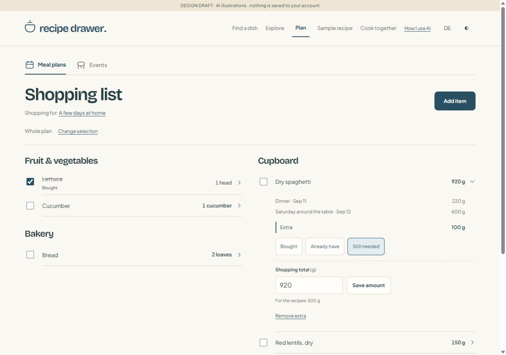

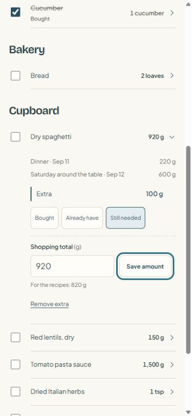

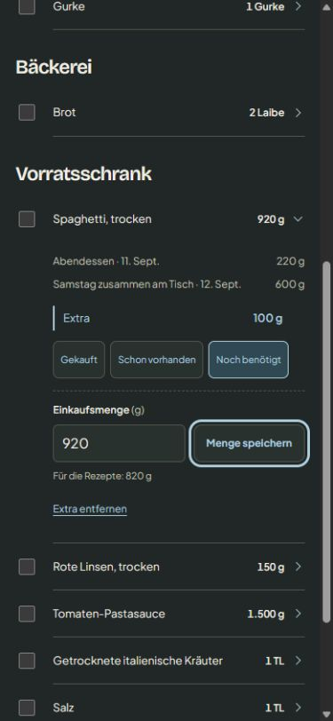

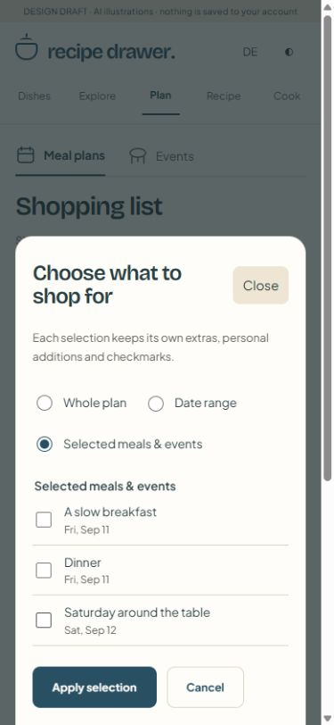

## Next reviewable layers

1. Review the newly wired plan/event editors and independent Plan again copies.
2. Complete the broader keyboard/browser acceptance pass for those editors.
3. Pack assumptions and Use the rest; keep intentional extras separate from
   purchase surplus. Show preview/cancel/confirm before adding any suggestion.
4. Shared preparation and meal leftovers, explicit outputs and allocations,
   followed by complete-journey acceptance and production-gap documentation.

Full pantry stock, prices, nutrition targets, automatic planning/timetables,
production sync and culinary yield/storage approval remain out of scope.

### Complete-dish reference follow-up

Browser checked at desktop, 390 px EN/light and 320 px DE/dark. Shared spaghetti
purchase status updated both recipe references. Editing from the second reference
kept focus there; 920 g produced Extra 100 g without changing 220/600 g recipe
requirements. A below-minimum edit reset to 820 g. Original quantities and purchase
state were restored. At 320 px, measured document width and scroll width both
305 px (no horizontal overflow). Evidence: planning-evidence/shopping-dish-mobile-de.png
and planning-evidence/shopping-dish-desktop.png. This remains a local prototype.

### Dish / Total columns and partial-coverage follow-up (current)

This supersedes the earlier aggregate-only purchase interaction. Source item IDs
(not translated recipe names) own coverage allocations within each shopping scope.
Repeated occurrences of the same recipe remain grouped in one displayed dish; its
checkbox covers those occurrences. Numeric units remain separate. @extra is a
separate allocation. Per-source increases request review; removed sources lose their
checks and do not silently recover them if reintroduced. Whole-list marking covers
all current allocations. Mixed have/bought coverage stays distinguishable from a
recipe quantity change.

Local storage now writes envelope version 3. Versions 1 and 2 are read without
rewriting on load; their existing full-quantity checks remain valid and materialize
into source allocations only when a dish is individually changed. Older prototype
code rejects v3 instead of silently losing partial checks. Invalid data and cross-tab
conflicts still block edits; failed storage writes retain the in-memory session.

Browser: name click checks 220 g only; Check all covers 820 g; Category displays a
mixed checkbox and 600 g remaining of 820 g. Partial coverage survives reload.
Arrow-only expansion, second-dish editing/focus, separate Extra 100 g coverage and
below-minimum reset were exercised. Original amounts/checks restored afterwards.
Desktop/light, 390 px/light and 320 px/DE/dark inspected; at 320 px the document
client/scroll widths both measured 305 px. Short counts omit a redundant unit word
(e.g. Cucumber: 1); source details retain the full count labels. Existing native
keyboard controls and focus styling remain; no full screen-reader audit is claimed.
Evidence: planning-evidence/shopping-columns-desktop.png and
planning-evidence/shopping-columns-mobile-de.png. No production integration or push.
